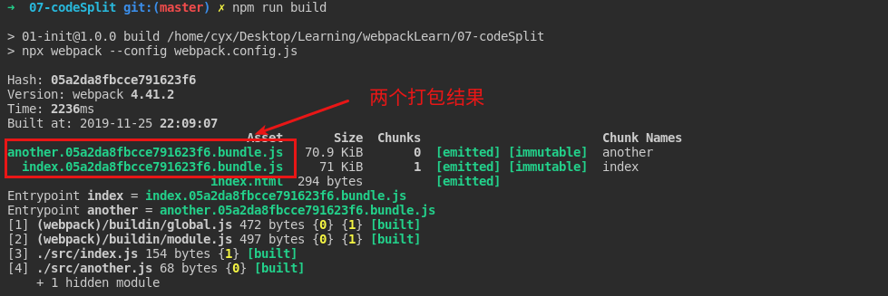

# Webpack 学习笔记

### 1. Webpack4 安装

```bash
# 进入到初始的项目文件夹下
cd 01-init

# 初始化，安装webpack 4
npm init -y
npm install webpack@4.41.2 webpack-cli -s
```

---

### 2. Webpack 配置文件

#### 1. 前期准备

**webpack 4 本身不需要配置文件, **但是相比于手动在终端输入大量配置信息, 添加配置文件 webpck.config.js

> Notes:
>
> path.resolve('/home', 'a') -> /home/a
>
> path.resolve('/home', '/a') -> '/a'
>
> \_\_dirname -> 当前目录的路径

#### 2. 树结构


- 添加 webpack.config.js

```javascript
const path = require('path');

module.exports = {
  entry: './src/index.js',
  output: {
    // 打包得到的文件名称
    filename: 'bundle.js',
    //　打包后所处的位置
    path: path.resolve(__dirname, 'dist')
  }
};
```

    + 按照打包的配置文件进行打包


---

### 3. npm 脚本配置

#### 1. 添加 npm 脚本

在 package.json 下的 scripts 中添加脚本命令


#### 2. 执行脚本


---

### 3. 添加 Loader

#### 1. loader 添加机制

##### 添加 loader

    + 先在webpack.config.js中添加module
    + 在module中添加rule
    + rule中需要添加对应文件的后缀和处理其使用的loader


##### 执行结果


#### 2. 常用 loader

| 加载名称   | loader                   | 加载文件     |
| ---------- | ------------------------ | ------------ |
| CSS        | style-loader, css-loader | .css         |
| Sass 加载  | sass-loader, node-sass   | .sass        |
| 文件       | file-loader              | 图片, 字体等 |
| excel 文件 | csv-loader               | .csv, .tsv   |
| xml        | xml-loader               | .xml         |
|            |                          |              |

##### xml-loader 测试

1. 配置 loader


2. 加入 xml 文件


3. 重新打包


4. 检查数据导入结果


---

### 4. 打包拆分

    1. 实现结果


2. webpack.config.js 的配置


3. 执行 npm run build 即可重新打包
4. 这里需要指定不同的打包文件名称,如果设定同样的文件名就会报错


5. html-webpack-plugin

2 中打包出的文件为 asset.bundle.js 和 package.bundle.js,因此在 index.html 中导入的文件必须写死为上述文件名，才能导入，但是如果这个时导出的文件名为 asset1.bundle.js 或者再拆出一个包的话,就没有办法自动导入，这个时候我们添加 html-webpack-plugin 插件可以自动在 index.html 中的添加打包出的 bundle 文件

**添加 webpack 插件**

- webpack.config.js

```javascript
const path = require('path');
const HtmlWebpackPlugin = require('html-webpack-plugin');

module.exports = {
  entry: {
    asset: './src/index.js',
    package: './src/package.js'
  },
  output: {
    filename: '[name].bundle.js',
    path: path.resolve(__dirname, 'dist')
  },
  plugins: [
    new HtmlWebpackPlugin({
      title: 'Output Management'
    })
  ]
};
```

- 重新打包


- 打包出的 index.html

```html
<!DOCTYPE html>
<html>
  <head>
    <meta charset="UTF-8" />
    <title>Output Management</title>
  </head>
  <body>
    <script type="text/javascript" src="asset.bundle.js"></script>
    <script type="text/javascript" src="package.bundle.js"></script>
  </body>
</html>
```

> 该插件或自动将打包得到的 js 文件导入到新创建的 html 文件中

---

### 5. Source Map 和 dev-server

#### 1. source map 作用

当代码代码运行出现问题的时候, 若不使用 source map 会出现的问题,无法定位错误代码到源文件, 而是定位到了打包文件 bundle


#### 2. 使用 source Map 之后

可以将源文件中报错的位置显示到控制台上


---

#### 3. Source Map Webpack 配置


---

#### 4. webpack server 和 watch

现在需要手动运行 npm run build 当代码改变的时候进行重新构建, 为了避免重复工作，我们需要添加自动构建工具

- webpack watch mode
- webpack-dev-server
- webpack-dev-middle

**(1) 观察者模式**

```bash
# 使用webpack自带的观察者模式
webpack --watch
```

- 优点: 当依赖图中的文件发生变化, 代码会重新被构建, 不用手动构建
- 缺点：并不会自动刷新浏览器，需要手动刷新

**(2) webpack-dev-server**

[webpack-dev-server 配置](https://www.webpackjs.com/configuration/dev-server/)

```bash
# 添加webServer
yarn add webpack-dev-server

# 启动webpack-server
webpack-dev-server --config webpack.config.js --open
```

**(3) webpack-dev-middleware**

> webpack-dev-middleware 是一个中间件,其将 webpack 处理后生成的文件传递给服务器, webpack-dev-server 内部用到了 webpack-dev-middleware 这个中间件

- 配置代码

```javascript
const express = require('express');
const webpack = require('webpack');
const webpackDevMiddleware = require('webpack-dev-middleware');

const app = express();
const config = require('./webpack.config.js');
const compier = webpack(config);

app.use(
  webpackDevMiddleware(compier, {
    publicPath: config.output.publicPath
  })
);

app.listen(3000, function() {
  console.log('Example app listening on port 3000!\n');
});
```

- webpack-dev-middleware 的输出文件存在内存中， publicPath 要和 config 中的 publicPath 一致，不然会找不到打包后的 bundle 文件

[webpack-dev-middleware 配置](<[https://www.webpackjs.com/guides/development/#%E4%BD%BF%E7%94%A8-webpack-dev-middleware](https://www.webpackjs.com/guides/development/#使用-webpack-dev-middleware)>) 还有很多坑,后序填

---

#### 5. 模块热替换

- 热更新：当文件进行修改的时候, 不需要直接刷新页面，可以直接

对修改模块进行修改刷新, 而不需要完全刷新

- webpack.config.js 配置


- 捕获文件的更新函数并操作回调


- 改变 print.js 之后,可以在 console 中看到结果


- 将 webpack-dev-server 从 webpack.config.js 中抽离

```javascript
const webpackDevServer = require('webpack-dev-server');
const webpack = require('webpack');

const config = require('./webpack.config.js');
const options = {
  contentBase: './dist',
  hot: true
};

webpackDevServer.addDevServerEntrypoints(config, options);
const compiler = webpack(config);
const server = new webpackDevServer(compiler, options);

server.listen(5000, 'localhost', () => {
  console.log('start');
});
```

此时可以将 devServer 从 webpack.config.js 中抽离, 这样当牵扯到比较复杂的 webpackDevServer 问题时可以简化 Webpack.config.js 的配置文件

- 存在的问题: 当完成热更新后虽然对应的模块已经被更新, 但是引用的文件还是使用原来的模块，因此如果不刷新的话就存在虽然模块更新但是展示的还是原有的交互和 UI

**故障模拟**

1. 我们创建一个 component.js 来模拟这个故障


2. 修改原来的 index.js 文件


3. 修改前结果


4. 修改 newComponent 中文案后结果


**解决方案**

- 当热更新触发的时候重新更新响应的元素


- 有一些和 HMR 平滑结合的 loader
  - style-loader, css-loader
  - react-hot-loader
  - vue loader
  - elm loader
  - redux HMR

[模块热替换](https://www.webpackjs.com/guides/hot-module-replacement/)

---

### 6. 构建生产环境

#### 0. 几个概念

- tree shaking: 将代码中无引用的代码不进行打包
- 开发环境: 开发环境中需要实时加载，HMR 等高性能模块，但是在生产环境中我们更需要更小的 bundle,更优化的资源以及改善加载时间.

#### 1. 环境配置

```bash
npm install webpack-merge -S
```

#### 2. webpack 生产环境拆分

- webpack.common.js: 在生产环境和开发环境公共的 webpack 配置

```javascript
const path = require('path');
const { CleanWebpackPlugin } = require('clean-webpack-plugin');
const HtmlWebpackPlugin = require('html-webpack-plugin');

module.exports = {
  entry: {
    app: './src/index.js'
  },
  output: {
    filename: '[name].bundle.js',
    path: path.resolve(__dirname, 'dist')
  },
  plugins: [
    new HtmlWebpackPlugin({
      title: 'Production'
    }),
    new CleanWebpackPlugin()
  ]
};
```

- webpack.dev.js: 开发环境用的单一的 server 配置文件

```javascript
const merge = require('webpack-merge');
// 用于js代码的压缩
const common = require('./webpack.common.js');

module.exports = merge(common, {
  devtool: 'inline-source-map',
  devServer: {
    contentBase: './dist'
  }
});
```

- webpack.prod.js: 生产环境下的用于代码压缩的 webpack 配置

```javascript
const merge = require('webpack-merge');
const UglifyJSPlugin = require('uglifyjs-webpack-plugin');
const common = require('./webpack.common.js');

module.exports = merge(common, {
  plugins: [new UglifyJSPlugin()]
});
```

---

### 7. 代码分离(打包)

- 入口起点(entry 手动分离)
- 使用 CommonsChunkPlugin 插件去重分离
- 动态导入，通过模块的内联函数来分离代码

#### 0. 实验准备

- index.js

```javascript
import _ from 'lodash';

var elem = document.createElement('div');

elem.innerText = _.join(['first', 'webpack'], ' ');

document.body.appendChild(elem);
```

- another.js

```javascript
import _ from 'lodash';

console.log(_.join(['1', '2', '3'], '-'));
```

**这里两个文件都添加了 lodash, 如果使用手动分离的方法, 则 lodash 会被打包两次，浪费性能，使用 splitChunks 可以优化打包方法**

#### 1. entry 手动分离

之前有记录过, 通过手动在 entry 中设置多个入口文件，然后分别构建依赖图，之后再分别打包

- 优点：简单直观
- 缺点: 如果多个 bundle 之间有重复的模块, 会重复被打包;方法不够灵活，不能按照逻辑进行拆分
- 实验过程


- 打包结果



**这里两个包的打包大小均有 70kb 以上，因为 lodash 本身的包大小就有 70k**

#### 2. 使用 CommonChunkPlugin

> webpack.optimize.CommonsChunkPlugin 已经被 webpack.config.js 中的 optimization.splitChunks 替代了，现在需要通过该设置来自动进行打包分离

- webpack.config.js 配置

```javascript
const path = require('path');
const HtmlWebpackPlugin = require('html-webpack-plugin');
const webpack = require('webpack');

module.exports = {
  entry: {
    index: './src/index.js',
    another: './src/another.js'
  },
  output: {
    filename: '[name].[hash].bundle.js',
    path: path.resolve(__dirname, 'dist')
  },
  plugins: [new HtmlWebpackPlugin()],
  optimization: {
    // splitChunks
    splitChunks: {
      // 配置对任何文件都采取分离
      chunks: 'all'
    }
  }
};
```

[optimization.splitChunks 配置手册](https://webpack.docschina.org/configuration/optimization/#optimization-splitchunks)

- 打包结果


**每个单独的文件打包后只有 2kb 以下，另外公共的包中有 70kb(lodash),　使打包结果更小**


#### 3. 动态打包

> 动态打包用到了 import().then()新特性

- webpack.config.js 配置文件

```javascript
const path = require('path');
const HtmlWebpackPlugin = require('html-webpack-plugin');

module.exports = {
  entry: {
    index: './src/index.js',
    another: './src/another.js'
  },
  output: {
    filename: '[name].[hash].bundle.js',
    path: path.resolve(__dirname, 'dist'),
    // 这个chunkFilename是打包响应文件给定的Chunkname
    chunkFilename: '[name].bundle.js'
  },
  plugins: [new HtmlWebpackPlugin()]
};
```

- 动态导入的 index.js


- 动态导入的 another.js


- 打包结果探查


#### 4. 存在问题

> 打包名称的顺序问题
>
> 猜测：当打包文件已经存在于 index.js 时候, 则不更换其名称，直接引用即可
>
> -> 文件已经有被打包过则直接引用，不生成新名称的打包文件

- 加入 Math.js 进行探查

```javascript
// another.js
const getComponent = async () => {
  const node = document.createElement('div');
  const _ = await import(/* webpackChunkName: 'anotherLodash' */ 'lodash');
  const math = await import(/* webpackChunkName: 'anotherMathjs' */ 'mathjs');
  node.innerHTML = _.join(
    ['Component', 'dynamic', 'import', math.sqrt(9).toString()],
    ' '
  );
  return node;
};

// third.js
const getComponent = async () => {
  const math = await import(/* webpackChunkName: 'thirdMath' */ 'mathjs');
  const elem = document.createElement('div');
  elem.innerHTML = math.sqrt(4);
  return elem;
};

getComponent().then(node => document.body.appendChild(node));
```

- 打包结果探查


- 结果

**当多个包且 chunkName 设置不同时, 此时 chunkName 为第一个打得包的 chunkName**

---

### 8. 懒加载

#### 1. webpack 配置

```javascript
const path = require('path');
const htmlWebpackPlugin = require('html-webpack-plugin');

module.exports = {
  entry: './src/index.js',
  output: {
    filename: 'bundle.js',
    path: path.resolve(__dirname, 'dist'),
    // 添加懒加载模块的ｃｈｕｎｋName
    chunkFilename: '[name].bundle.js'
  },
  plugins: [new htmlWebpackPlugin()],
  mode: 'development'
};
```

#### 2. 添加懒加载模块

```javascript
import _ from 'lodash';

var elem = document.createElement('div');
var btn = document.createElement('button');

elem.innerText = _.join(['first', 'webpack'], ' ');
btn.innerHTML = 'Click Me';
btn.onclick = e =>
  import(/* webpackChunkName: "printjs" */ './print').then(func =>
    func.default()
  );

elem.appendChild(btn);
document.body.appendChild(elem);
```

#### 3. 查看打包结果


#### 4. 源码分析

- [参考资料](https://www.cnblogs.com/zhaoweikai/p/10945780.html)

- bundle.js 文件分析

  - installedModules:用来记录已经导入的模块信息(.js 文件)

    - i: 该模块的 key 值
    - l: 是否已经记录的 flag
    - exports: 从该模块导出的方法

  - installedChunks: 用来记录每个包的是否加载的信息(文件中模块的集合体)

    - 0: 已经加载

  - installedChunkData: 0; [resolve, reject, promise];undefined

  - \_\_webpack_require\_\_方法(webpack 的 require 方法)

    - 

  - 1 -> 该模块已经被加载就直接导出他的 exports

    - 2 -> 更新 installedModules, 并执行 modules 的函数(更新 module 的 exports), 之后导出 module.exports

    * **总结**: 这个方法主要是导出某个 js 文件中的方法，将其 exports 导出, 如果没有被导出过就需要重新在全局中注册, 如果注册过直接导出 exports 即可

  - \_\_webpack_require\_\_e 方法

    - 

    - promise: 异步导入文件结果

    - installedChunkData: 缓存结果,

    - 1 -> 0 为已经添加到 module 模块，但是还没有被加载完; 加载完毕将 installChunkData[chunkId]的值改为响应的 promise 而不是 0,installedChunckData[2]为一个加载的 promise

    - 2 -> 将 installedChunkData 设置对应模块 Promise[resolve, reject, promise]

    - 3 -> 添加一个 script 标签将对应用到的 module 引入到页面中

      - 确定 src 加载函数 jsonpScriptSrc

      

      - onScriptComplete 函数: 用于判断 script 标签加载完毕的回调函数

      

    - 4 -> 添加 script 标签页面中

    - 5 -> 返回加载模块结果(一个 chunk.js)

    - **总结：**该函数主要做的事：根据 chunkId 进行加载，如果已经加载就不需要重新加载;如果没有加载过且处于加载过程中返回 promise;如果没有被加载过, 也不在加载过程中，创建一个 promise, 并组成一个 resolve, reject, promise 数组, 最后返回 promise

  - 自执行代码分析

    - 

      **主要功能**: 从全局的 webpackJsonp 中拿到了加载模块的列表，重写了 jsonArray 的 push 方法且将 jsonArray 内的模块进行懒加载

      **入参**: data[0]: chunkIds, data[1]: chunks 包含的 module

      

    - 重写的 push 方法 webpackJsonpCallback

      - 代码思路：先根据 chunkId 在 installedChunks 判断现在模块加载进度(已加载(installedChunks[chunkId]=0)， 加载中(installedChunks[chunkId]=[resolve, reject, promise])，未加载(installedChunks[chunkId]=undefined)), 如果是加载中的情况下将其 resolve 放到 resolveList 中，之后将 installedChunks[chunkId]置 0，表示其为加载完毕状态，并在全局的 modules 中注册已经加载的 modules, 最后出队依次执行 resolve 方法即可，因为执行了 resolve 方法才会执行代码中.then 里面的代码, 注意在加载 chunks 时候的那个 push 是全局的 push 所以是 webpackJsonpCallback 方法！！！

> 引用：
>
> 调用\_\_webpack_require\_\_.e('printjs')方法，实际只是将对应的 print.bundle.js 文件加载和创建了一个异步的 promise（因为并不知道什么时候这个文件才能执行完，因此需要一个异步 promise，而 promise 的 resolve 会在对应的文件加载时执行，这样就能实现异步文件加载了），并没有将懒加载文件中保存的模块代码执行。
>
> 在加载对应 print.bundle.js 文件代码时，通过调用 webpackJsonpCallback 函数，实现触发加载文件时创建的 promise 的 resolve。
>
> resolve 触发后，会执行 promise 的 then 回调，这个回调通过**webpack_require**函数执行了真正需要模块的代码（注意：如果 print.bundle.js 中有很多模块，只会执行用到的模块代码，而不是执行所有模块的代码），执行完后将模块的 exports 返回给 promise 的下一个 then 函数，该函数也就是真正的业务代码了。

---

### 9. 缓存

	#### 0. 缓存机制

为了使网站加载速度更快，通常浏览器使用缓存的方法来提升性能，通过资源名进行缓存命中，命中缓存来降低网络流量。如果在新版本部署中没有更改资源名，则浏览器会误以为是同一资源，加载缓存版本,这样新版本就没有成功部署。因此通过webpack配置缓存需要做到两点: 1. 能够被浏览器缓存;2. 在文件内容更新后能够请求到新文件。

#### 1. 几个概念

| hash类型  | 获取hash方法                                                 | 优点                                         | 缺点                                                         |
| --------- | ------------------------------------------------------------ | -------------------------------------------- | ------------------------------------------------------------ |
| hash      | 整个项目版本更新的hash值 (项目的hash值)                      | -                                            | 更新之后重置整个项目的hash达不到浏览器缓存的目的             |
| chunkhash | 根据不同的入口文件进行依赖文件解析，构建成相同的chunk (从一个入口进入的所有依赖图) | 能够对某一个入口的文件进行重新命名有利于缓存 | 该入口内的所有依赖都会更改其chunkname(包括一些没有更新的部分) |
| css分离   | 对css文件而言如果css不发生改变当引用文件发生改变时不会被重新编译 | 便于sourceMap, css单独请求，并行请求         | 需要导入extract-text-webpack-plugin, 在webpackV4中使用mini-css-extract-plugin, 没有HMR |

#### 2. 实验准备

	+ index.js (入口一 )

~~~javascript
import _ from 'lodash';
import { getComponent } from './getComponent';

var elem = document.createElement('div');

elem.innerText = _.join(['first', 'webpack'], ' ');

const comp = getComponent();

document.body.appendChild(elem);
document.body.appendChild(comp);
~~~

+ another.js(入口２)

~~~javascript
import './style.css';

const node = document.createElement('div');
node.innerText = 'another';
node.classList.add('text');
document.body.appendChild(node);
~~~

+ getComponent.js

~~~javascript
import './style.css';

export const getComponent = () => {
  const node = document.createElement('div');
  node.classList.add('text');
  node.innerHTML = 'text';
  return node;
};
~~~

+ webpack.config.js

~~~javascript
const path = require('path');
const { CleanWebpackPlugin } = require('clean-webpack-plugin');
const HtmlWebpackPlugin = require('html-webpack-plugin');

module.exports = {
  entry: {
    index: './src/index.js',
    another: './src/another.js'
  },
  output: {
	// 配置filename带上hash
    filename: '[name].[hash].bundle.js',
    path: path.resolve(__dirname, 'dist')
  },
  mode: 'development',
  plugins: [
    new CleanWebpackPlugin(),
    new HtmlWebpackPlugin({
      title: 'Cache'
    })
  ],
  module: {
    rules: [
      {
        test: /\.css$/,
        use: ['style-loader', 'css-loader']
      }
    ]
  }
};
~~~

#### 3. 实验验证

##### 1. hash结果 

+ 第一次打包结果


+ 更改index.js而不更改another.js


##### 2. chunkhash

~~~javascript
// 更改webpack.config.js中的filename
  output: {
    filename: '[name].[chunkhash].bundle.js',
    path: path.resolve(__dirname, 'dist')
  },
~~~

+ 第一次打包结果


+ 更改another.js


+ 改动style.css(两者文件均调用的公共文件)


##### 3. css从js中分离

	+ webpack.config.js

~~~javascript
const path = require('path');
const { CleanWebpackPlugin } = require('clean-webpack-plugin');
const HtmlWebpackPlugin = require('html-webpack-plugin');
const miniCssPlugin = require('mini-css-extract-plugin');

module.exports = {
  entry: {
    index: './src/index.js',
    another: './src/another.js'
  },
  output: {
    filename: '[name].[chunkhash].bundle.js',
    path: path.resolve(__dirname, 'dist')
  },
  mode: 'development',
  plugins: [
    new CleanWebpackPlugin(),
    new HtmlWebpackPlugin({
      title: 'Cache'
    }),
    new miniCssPlugin({
      // 打包得到的css包名
      filename: '[name].[hash].css',
      // 在运行过程中的chunk的包名
      chunkFilename: '[name].[hash].css'
    })
  ],
  module: {
    rules: [
      {
        test: /\.(sc|sa|c)ss$/,
        // 用miniCssPlugin.loader 代替 style-loader
        use: [miniCssPlugin.loader, 'css-loader', 'sass-loader']
      }
    ]
  }
};
~~~

+ 打包结果


---

### 10. Library 构建

#### 1. 打包目标

+ 设置指定包名（配置webpack.config.js中的filename即可）
+ 不打包lodash, 使用外部的lodash
+ 能够以库的形式被调用

#### 2. 外部化lodash

> 外部化lodash的意思是，包内不含有lodash, 而是默认当作peerDependency，用户已经将该lodash安装好，因此可以将是否需要安装library这个权利交给用户

**配置方法externals:**


+ commonjs: 该包支持Commonjs

+ commonjs2: 该报的export为module.exports.default

+ root: 运行环境内应由一个为名为_的lodash全局变量

+ amd: AMD模块系统

  [webpack externals深入理解](https://segmentfault.com/a/1190000012113011)

这里配置externals的目的是除了root情况下外，我们调用 import _ from lodash这条语句时，转化为CMD,AMD对应的加载语句，而使这句不报错

#### 3. Library的暴露


+ library: 暴露导出库的全局变量名
+ libraryTarget: 导出方式
  + var: 允许通过script标签导入
  + this: 通过this对象
  + window: 通过注册到全局变量中
  + umd: 允许以AMD或CMD, 一般导出包都是以这种形式

#### 4. 将bundle路径添加到package.json


#### 5. npm包发布

